# Pathology Lab Management System

A comprehensive, role-based pathology lab management portal designed to streamline diagnostic reporting, patient appointment booking, and lab administration. Built with **Java (Jakarta EE)**, **MySQL**, and modern frontend aesthetics, it ensures 24/7 access to digital reports, 99.9% uptime, and lightning-fast report delivery.

---

## 🚀 Key Features

* **Role-Based Access Control:** Dedicated, secure portals for **Admin**, **Staff**, and **Patients**.
* **Instant Digital Reports:** Upload reports in seconds, and patients can download PDFs securely at any time.
* **Smart Appointment Booking:** Book tests seamlessly online or manually add walk-in patients via the staff console.
* **Priority Queues:** Manage urgent tests vs. normal tests effectively.
* **Real-time Status Tracking:** Track reports from *Pending* to *Delivered*.
* **Secure & Responsive:** BCrypt password hashing and responsive web UI for mobile and desktop.

---

## 🛠️ Technology Stack

* **Backend:** Java 21, Jakarta Servlet API 6.0, Maven
* **Database:** MySQL 8.3 (JDBC)
* **Security:** BCrypt (Password Hashing)
* **Utilities:** Jakarta Mail (Email Notifications), Lombok
* **Frontend:** HTML5, CSS3, JavaScript (Vanilla), JSP

---

## 📊 Database Schema Architecture

The relational database (`MySQL`) is structured to maintain data integrity across users, patients, and their diagnostic records.

### 1. Users Table
Manages authentication and role assignment (`ADMIN`, `USER`, `STAFF`).
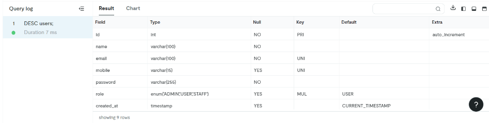

### 2. Patients Table
Stores patient demographic data. Linked to the `users` table.
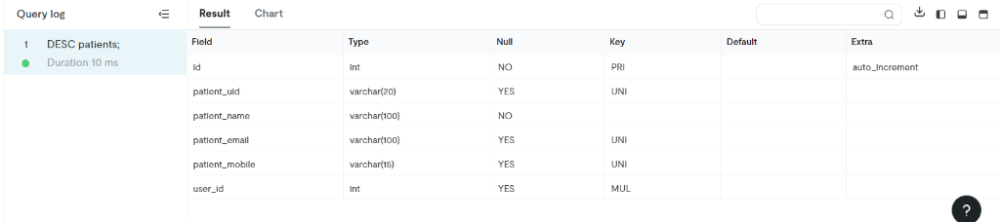

### 3. Reports Table
Tracks pathology test results, file paths, and current status (`Pending`, `Completed`, `Delivered`).
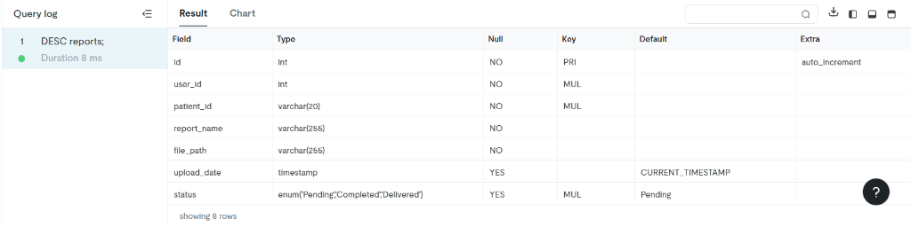

### 4. Appointments Table
Handles online and walk-in bookings, locations, and time slots. Statuses include `Booked`, `Confirmed`, `Completed`, and `Cancelled`.
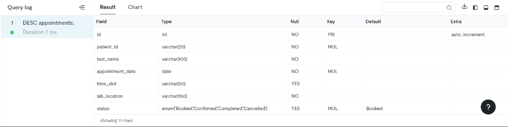

### 5. Feedback Table
Captures user feedback and ratings.
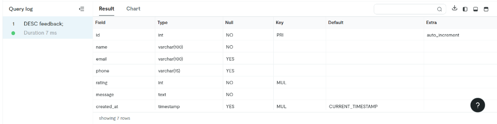

---

## 📸 System Portals & Walkthrough

### 1. Landing & Authentication
A beautiful entry point letting users choose their respective workspace, followed by a clean authentication interface.
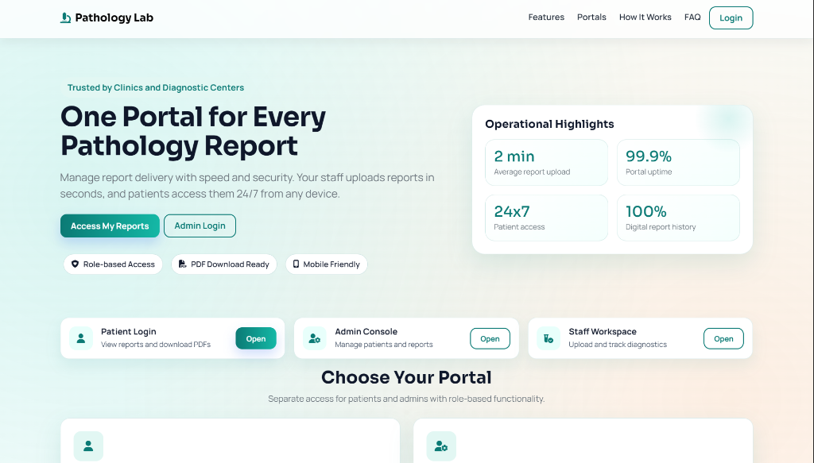
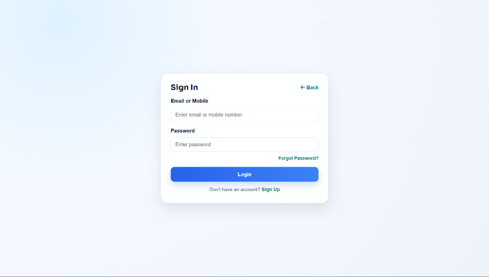

### 2. Admin Command Center
Provides a bird's-eye view of lab operations. Admins can view analytics, manage patient records, and oversee all uploaded reports.
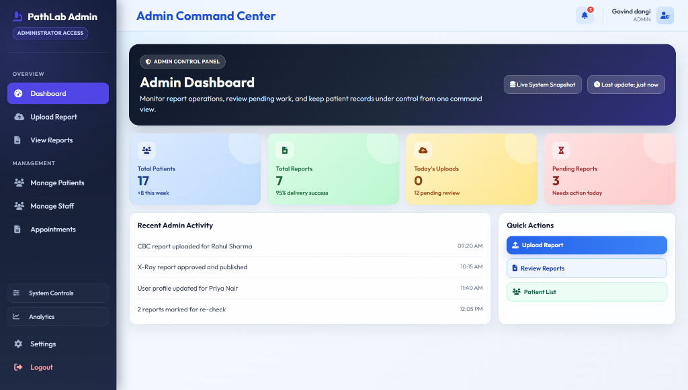
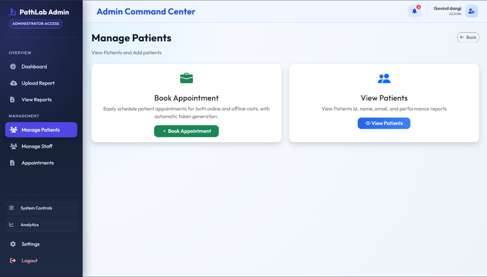
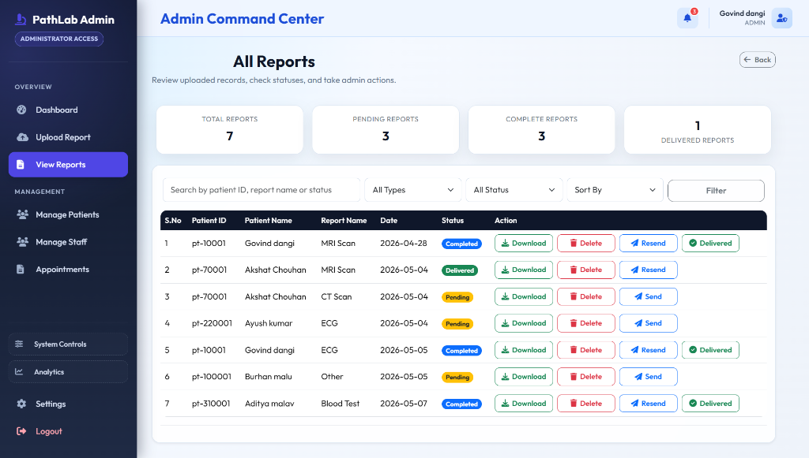
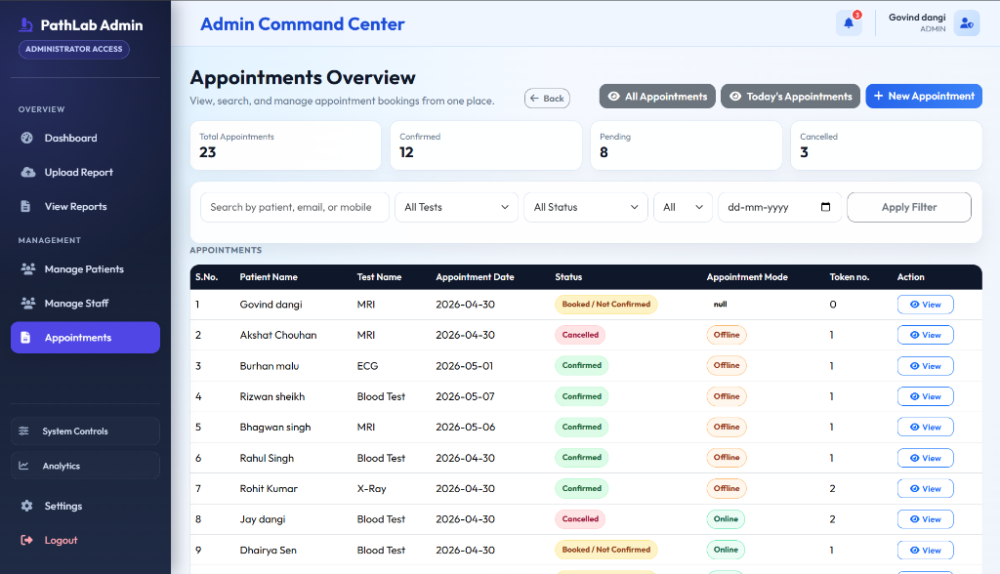

### 3. Staff Operations Console
Optimized for speed, allowing lab technicians to quickly book walk-in appointments, manage queues, and upload digital reports (PDF/Images).
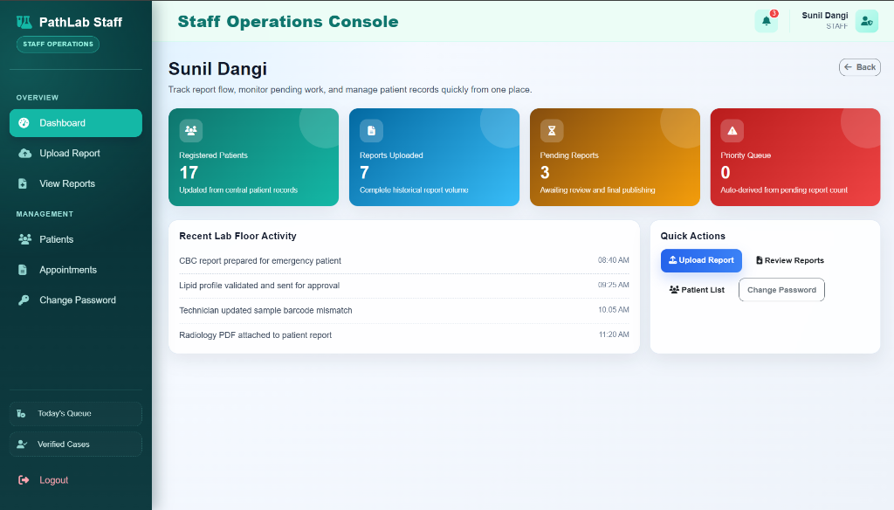
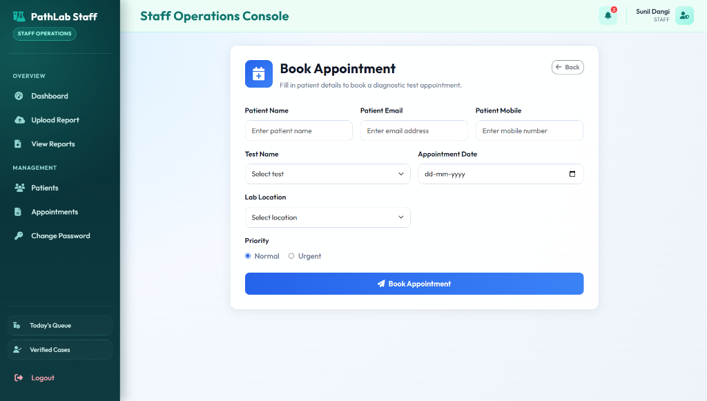
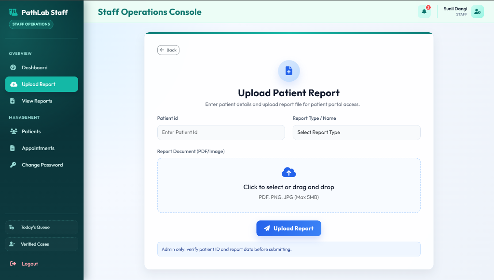

### 4. Patient Self-Service Portal
A clean, reassuring interface for patients to view test timelines, book appointments for themselves or family members, and download their finalized PDF reports.
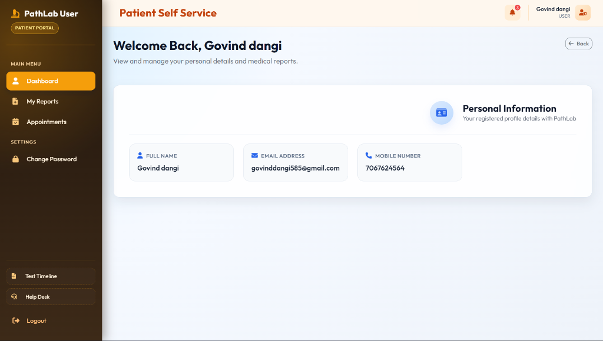
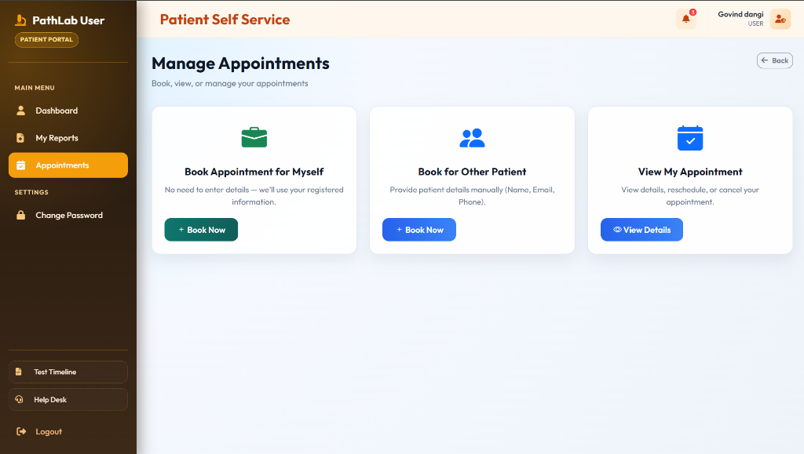
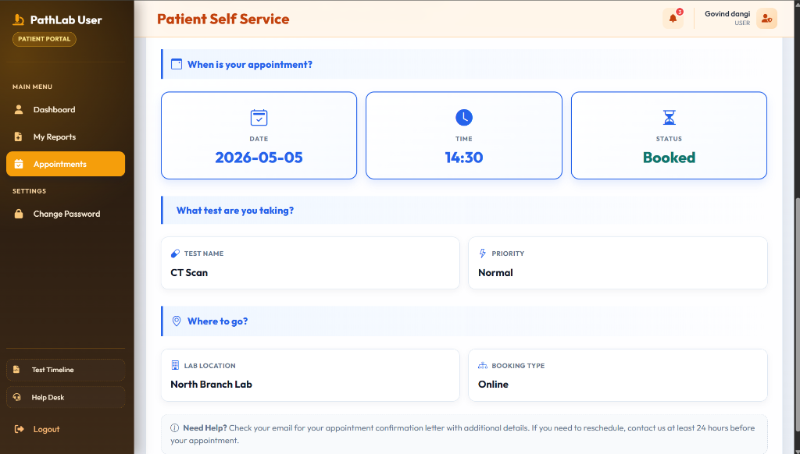
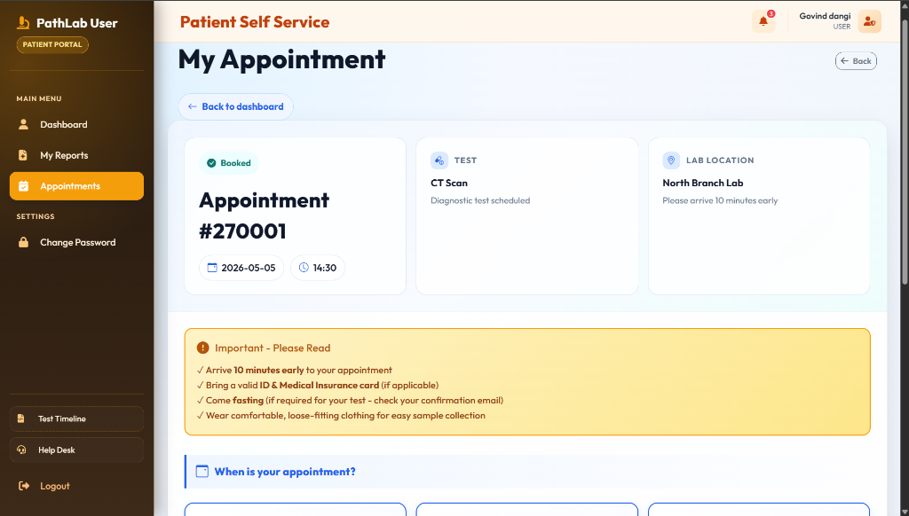
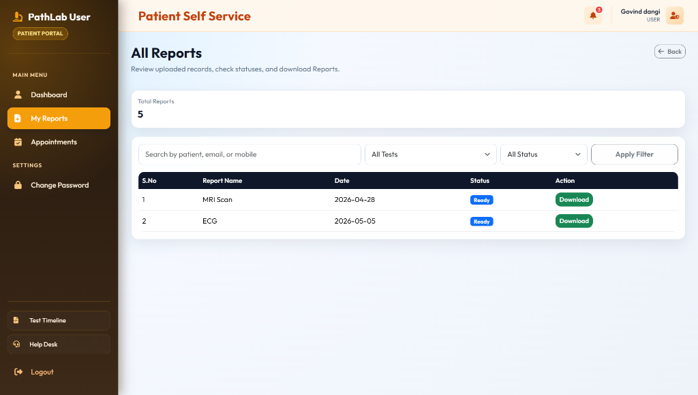

---

## ⚙️ Setup & Installation

1. **Clone the repository.**
2. **Database Setup:** 
   * Import the MySQL schema into a database named (e.g., `pathology_lab`).
   * Update database credentials in the application's config properties.
3. **Build the project:** 
   * Run `mvn clean install` to generate the `.war` file.
4. **Deploy:** 
   * Deploy the generated `Pathlogy_Lab.war` to a Servlet container (e.g., Apache Tomcat 10+).
5. **Access:**
   * Open your browser and navigate to `http://localhost:8080/Pathlogy_Lab`.
