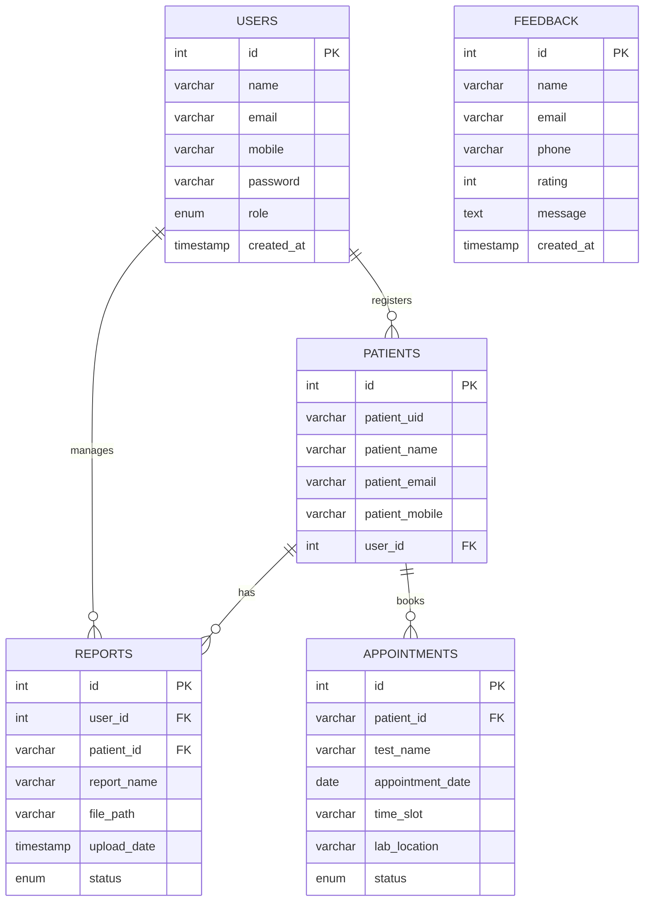

# Pathology Lab Management System

A comprehensive, role-based pathology lab management portal designed to streamline diagnostic reporting, patient appointment booking, and lab administration. Built with **Java (Jakarta EE)**, **MySQL**, and modern frontend aesthetics, it ensures 24/7 access to digital reports, 99.9% uptime, and lightning-fast report delivery.

---

## 🚀 Key Features

* **Role-Based Access Control:** Dedicated, secure portals for **Admin**, **Staff**, and **Patients**.
* **Instant Digital Reports:** Upload reports in seconds, and patients can download PDFs securely at any time.
* **Smart Appointment Booking:** Book tests seamlessly online or manually add walk-in patients via the staff console.
* **Priority Queues:** Manage urgent tests vs. normal tests effectively.
* **Real-time Status Tracking:** Track reports from *Pending* to *Delivered*.
* **Secure & Responsive:** BCrypt password hashing and responsive web UI for mobile and desktop.

---

## 🛠️ Technology Stack

* **Backend:** Java 21, Jakarta Servlet API 6.0, Maven
* **Database:** MySQL 8.3 (JDBC)
* **Security:** BCrypt (Password Hashing)
* **Utilities:** Jakarta Mail (Email Notifications), Lombok
* **Frontend:** HTML5, CSS3, JavaScript (Vanilla), JSP

---

## 📊 Database Schema Architecture

The relational database (`MySQL`) is structured to maintain data integrity across users, patients, and their diagnostic records. Below is the Entity-Relationship (ER) diagram representing the system's architecture.

*(Note: Original raw schema screenshots are available in the `screenshots/` directory for reference).*

---

## 📸 System Portals & Walkthrough

### 1. Landing & Authentication
A beautiful entry point letting users choose their respective workspace based on their roles. The design prioritizes clarity with distinct login paths for patients, staff, and admins.

 

### 2. Admin Command Center
Provides a bird's-eye view of lab operations. Admins get high-level analytics on the dashboard, including total patients, reports, and pending items.

The **Manage Patients** module allows administrators to quickly register new patients or lookup existing records.

The **All Reports** tab lets admins oversee the entire lifecycle of diagnostic reports. Admins can download, delete, resend, or mark reports as delivered directly from this table.

The **Appointments Overview** tab lists all upcoming and past bookings, easily filterable by status or date.

### 3. Staff Operations Console
Optimized for speed, allowing lab technicians to focus on their core tasks. The dashboard highlights priority queues and today's workload.

Staff members can quickly book walk-in appointments, selecting tests, dates, and locations through an intuitive form.

The **Upload Report** interface features a clean drag-and-drop zone to securely attach PDF results to patient profiles.

### 4. Patient Self-Service Portal
A clean, reassuring interface for patients. The welcome screen shows personal details and provides quick navigation to test history.

Patients can independently view all their past diagnostic reports and download the PDFs instantly.

The **Manage Appointments** screen allows patients to book new visits (for themselves or family members) and review existing bookings.

Detailed appointment summaries give patients crucial instructions, such as fasting requirements and when to arrive at the lab.

 

---

## ⚙️ Setup & Installation

1. **Clone the repository.**
2. **Database Setup:** 
   * Create a MySQL database (e.g., `pathology_lab`).
   * Run the SQL scripts to generate the tables as defined in the ER diagram.
   * Update database credentials (`db.url`, `db.username`, `db.password`) in the application's config properties.
3. **Build the project:** 
   * Run `mvn clean install` to generate the `.war` file.
4. **Deploy:** 
   * Deploy the generated `Pathlogy_Lab.war` to a Servlet container (e.g., Apache Tomcat 10+).
5. **Access:**
   * Open your browser and navigate to `http://localhost:8080/Pathlogy_Lab`.
